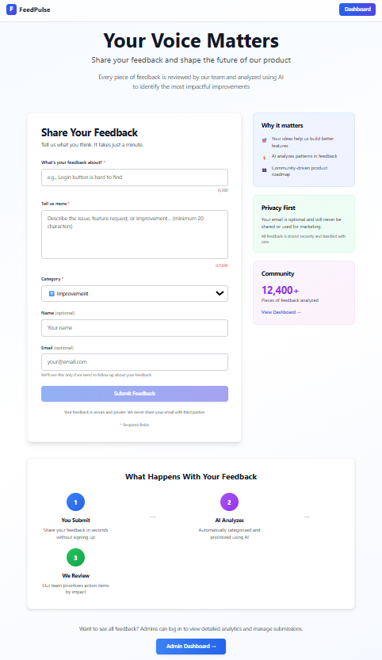
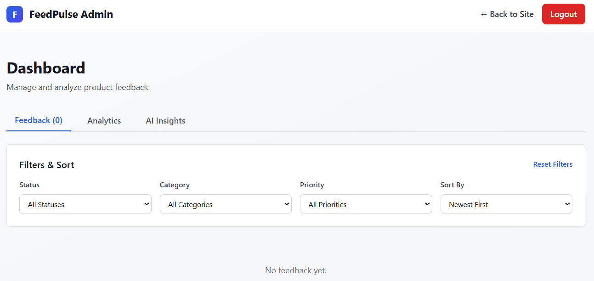

# FeedPulse — AI-Powered Product Feedback Platform

A lightweight internal tool that collects product feedback and feature requests from users, then uses Google Gemini AI to automatically categorize, prioritize, and summarize them.

## ✨ Key Features

### 📝 Public Feedback Submission (No Sign-In Required)

- Clean, simple form for users to submit feedback without any authentication
- Optional email field for follow-up communications
- Automatic character counters for guidance
- Real-time validation and error handling
- Mobile-responsive design

### 🤖 AI-Powered Analysis

- Google Gemini automatically analyzes every submission
- Auto-categorizes feedback (Bug, Feature Request, Improvement, etc.)
- Auto-prioritizes by potential impact (Low, Medium, High, Critical)
- Generates concise summaries for quick scanning
- Produces insights from collective feedback

### 📊 Admin Dashboard

- View all submitted feedback in one place
- Filter by status, category, and priority
- Sort chronologically
- Update feedback status (track progress)
- Delete outdated feedback
- View analytics and statistics
- Generate AI insights on demand

### 🛡️ Privacy & Security

- No authentication required for submissions (frictionless)
- Email is optional and never shared
- Secure data storage
- GDPR-ready architecture

## Tech Stack

### Frontend

- **Next.js 15** (TypeScript) — React framework for fast performance
- **Tailwind CSS** — Beautiful, responsive UI
- **Axios** — HTTP client for API communication
- **React Hooks** — State management

### Backend

- **Node.js + Express** (TypeScript) — Robust REST API
- **MongoDB + Mongoose** — Flexible NoSQL database
- **Google Gemini API** — State-of-the-art AI analysis

### Infrastructure

- **Docker Compose** — Easy local development and deployment

## Project Structure

```
feedpulse/
├── frontend/                    # Next.js application
│   ├── app/
│   │   ├── page.tsx            # Public Feedback Form (No Auth)
│   │   ├── dashboard/page.tsx  # Admin Dashboard (Can add auth later)
│   │   ├── layout.tsx          # Root layout
│   │   └── globals.css         # Global styles
│   ├── components/
│   │   ├── FeedbackForm.tsx       # Submission form
│   │   ├── FeedbackList.tsx       # Feedback display
│   │   ├── FeedbackFilters.tsx    # Filter controls
│   │   └── AnalyticsDashboard.tsx # Analytics charts
│   ├── lib/api.ts              # API client
│   ├── types/feedback.ts       # TypeScript types
│   └── package.json
│
├── backend/                     # Node.js + Express API
│   ├── src/
│   │   ├── server.ts           # Express entry point
│   │   ├── routes/feedbackRoutes.ts
│   │   ├── controllers/feedbackController.ts
│   │   ├── models/Feedback.ts
│   │   ├── services/gemini.service.ts
│   │   └── utils/database.ts
│   ├── package.json
│   ├── .env
│   ├── .env.example
│   └── tsconfig.json
│
├── docker-compose.yml
├── SETUP.md         # Detailed setup guide
├── API.md           # API documentation
└── README.md
```

## Getting Started in 5 Minutes

### 1. Prerequisites

- Node.js 18+
- MongoDB (local or [MongoDB Atlas](https://atlas.mongodb.com))
- [Google Gemini API Key](https://aistudio.google.com/app/apikey)

### 2. Backend Setup

```bash
cd backend
npm install
cp .env.example .env
# Edit .env with:
# - Your GEMINI_API_KEY from https://aistudio.google.com/apikey
# - MongoDB connection string (local or MongoDB Atlas)
npm run dev
# Backend runs on http://localhost:5001
```

### 3. Frontend Setup

```bash
cd frontend
npm install
npm run dev
# Frontend runs on http://localhost:3000
```

### 4. Access the App

- **Submit Feedback**: http://localhost:3000 (no login needed!)
- **Admin Dashboard**: http://localhost:3000/dashboard
- **API Health**: http://localhost:5001/api/health

## Environment Variables

### Backend (.env)

```env
PORT=5001
MONGODB_URI=mongodb://localhost:27017/feedpulse
# OR for MongoDB Atlas:
# MONGODB_URI=mongodb+srv://<username>:<password>@cluster.mongodb.net/?appName=FeedPulse
GEMINI_API_KEY=your_api_key_from_google_ai_studio
JWT_SECRET=your_jwt_secret_key_here_change_in_production
NODE_ENV=development
```

### Frontend (.env.local)

```env
NEXT_PUBLIC_API_URL=http://localhost:5001
```

## API Endpoints

### Feedback Submission (Public - No Auth)

```bash
POST /api/feedback
Content-Type: application/json

{
  "title": "Login button is hard to find",
  "description": "When I first used the app...",
  "userEmail": "optional@example.com"  # Optional
}
```

### Admin Endpoints (No Auth - Add Later as Needed)

- `GET /api/feedback` — Get all feedback (with filters)
- `GET /api/feedback/:id` — Get single feedback
- `PUT /api/feedback/:id` — Update status/priority
- `DELETE /api/feedback/:id` — Delete feedback
- `GET /api/feedback/analytics` — Analytics data
- `GET /api/feedback/insights` — AI insights

See [API.md](./API.md) for complete documentation.

## Screenshots

### 1. Public Feedback Submission Form



- **Location**: http://localhost:3000
- **Features**:
    - Clean form with Title, Description, Category fields
    - Optional Name and Email fields
    - Real-time character counters
    - Success/Error messages after submission
    - Mobile responsive design

### 2. Admin Dashboard



- **Location**: http://localhost:3000/dashboard
- **Features**:
    - **Feedback Tab**: List of all submissions with sentiment badges, filters by Status/Category/Priority, inline editing, delete button
    - **Analytics Tab**: Charts showing feedback breakdown by category, status, and priority with real-time statistics
    - **AI Insights Tab**: AI-generated insights with recommendations for product improvements and summary of common themes

**Admin Credentials:**

- Email: `admin@feedpulse.com`
- Password: `FeedPulse@123`

## Using Docker

```bash
docker-compose up
```

This starts:

- Frontend on http://localhost:3000
- Backend on http://localhost:5001
- MongoDB on localhost:27017

## Roadmap

**V1.0 (Current)**

- ✅ Public feedback submission (no auth)
- ✅ AI categorization & prioritization
- ✅ Admin dashboard
- ✅ Analytics & insights

**V2.0 (Planned)**

- [ ] Admin authentication
- [ ] Email notifications when feedback is updated
- [ ] Export to CSV/PDF
- [ ] Slack/Teams integration
- [ ] Advanced search & tagging
- [ ] Team management

## FAQ

**Q: Do users need to sign up or log in?**
A: No! Feedback submission is completely anonymous. Email is optional.

**Q: How does the AI categorization work?**
A: Each submission is sent to Google Gemini, which analyzes the title and description to automatically identify the category (Bug, Feature, etc.) and priority level.

**Q: Is the dashboard public or private?**
A: Currently the dashboard is public (can view all feedback). You can add authentication in V2.0 if needed.

**Q: Where is the data stored?**
A: By default, data is stored in a local MongoDB instance. For production, use MongoDB Atlas.

**Q: Can I use this for my own product?**
A: Absolutely! It's designed to be forked and customized.

## Support

📖 For setup help: See [SETUP.md](./SETUP.md)
📚 For API docs: See [API.md](./API.md)
🐛 For issues: Create a GitHub issue

## License

MIT — Use it however you like!
